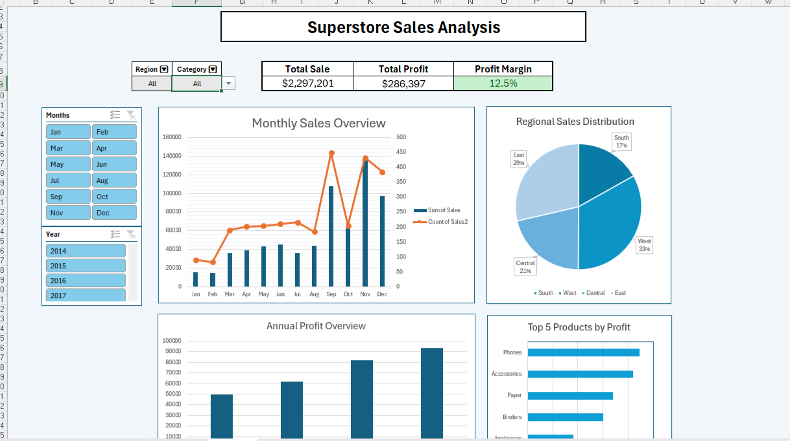

# 🛒 Superstore SQL Analysis

This project showcases exploratory and business-focused data analysis using SQL on the popular Superstore dataset. The goal is to derive meaningful insights related to sales performance, profitability, customer segmentation, and regional trends using structured queries.

---

## 📌 Project Objectives

- Analyze sales, profit, and discount trends across categories and regions
- Identify the most profitable segments and shipping modes
- Discover regional performance differences
- Provide actionable business insights based on SQL queries

---

## 🛠 Tools & Technologies

- **SQL** (MySQL)
- **DB Fiddle / Jupyter SQL / DBeaver** (for query execution)
- **Excel** (for dashboard visualizations – see Excel version [here](https://github.com/Farnazfarghadani/Superstore-SQL-Analysis))

---

## 📊 Key Analysis Areas

- Total sales and average profit by region
- Category and sub-category profitability
- Discounts vs. profitability relationship
- Monthly sales trends
- Customer segmentation by order volume

---

## 📈 Sample Insights

- 📦 **Technology** is the most profitable category despite not having the highest sales volume.
- 🗺️ The **West region** generates the most revenue, while the **South** has lower profitability margins.
- 🚚 **Standard Class** is the most commonly used shipping mode, but **Second Class** yields higher profit margins.

---

## 📷 Visuals

> Include a screenshot of the Excel dashboard here, if available:

---

## 📚 Dataset

- [Superstore Dataset (Kaggle)](https://www.kaggle.com/datasets/vivek468/superstore-dataset-final)

---

## 👩‍💻 Author

- **Farnaz Farghadani**
- 📫 [LinkedIn](https://www.linkedin.com/in/farnaz-farghadani-chaharsoughi/) 

---

⭐️ If you liked this project, give it a star and feel free to fork or suggest improvements!

